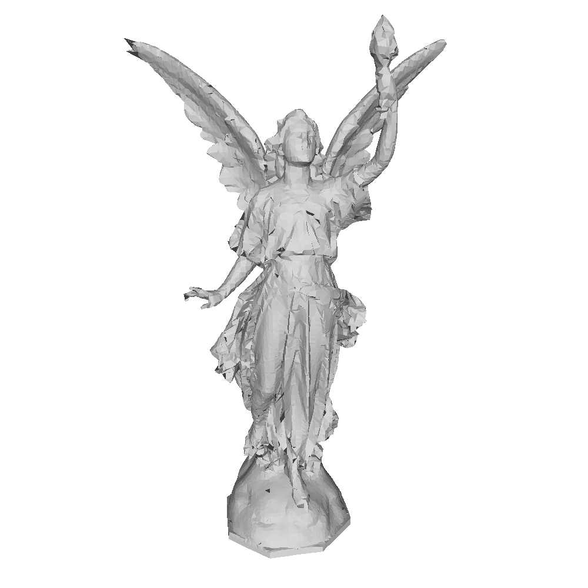

# QEMを用いた頂点クラスタリングによるメッシュ簡略化




### 概略

頂点クラスタリングによりメッシュ簡略化を行う．**QEM**を用いて頂点座標を計算する．  
* 重み無し**QEM**
* **Tikhonov**正則化
* クリッピングなし

セルの大きさを「**bounding box**の最長辺の◯◯%」として◯◯を入力し，`VertexClustering`クラスで頂点クラスタリングを行う．`VertexClustering::calc_bounding_box()`でメッシュの**bounding box**を計算し，`VertexClustering::compute()`で簡略化されたメッシュを計算する．  

3次元グリッドは，セルから新頂点番号へのマップを使った疎グリッドで表現する．このマップは(ix, iy, iz)をキーとするハッシュテーブル`std::unordered_map`を使用する．`Key`として`Eigen::Vector3i`型を使いたいが，ハッシュ値を計算できないため`EigenVector3iHasher`クラスを用意する．

**QEM**は以下のクラスで表現する．
```
struct QuadricErrorMetric
{
    Eigen::Matrix3d A;
    Eigen::Vector3d b;

    Eigen::Vector3d compute(double weight, Eigen::Vector3d c)
    {
        Eigen::Matrix3d A_dash = A + weight * Eigen::Matrix3d::Identity();
        Eigen::Vector3d b_dash = b + weight * c;
        return A_dash.inverse() * b_dash;
    }
};
```
各セルの**QEM**は`std::vector<QuadricErrorMetric>`で保存する．

`VertexClustering::compute()`で行う処理は，以下の通りである．

1. セルの個数を計算する．  
    - 範囲外アクセスを避けるため，セルの個数をxyz軸方向に一つずつ増やす．

1. 各面を走査し，次の処理を行う．
    - 三角形の各頂点を含むセル番号(ix, iy, iz) を計算する．
    - 3頂点のセル番号が異なる（非退化面である）とき，各頂点のセルをマップ`cell_map`に追加し，新しい面リストに面を追加する．

1. 各面を走査し，頂点を含むセルが`cell_map`に含まれるとき，`std::vector<QuadricErrorMetric> QEM`の行列$A$，ベクトル$\bm{b}$にそれぞれ$\bm{n}_f\bm{n}_f^\top, \ \bm{n}_f\bm{n}_f^\top \bm{v}$を足し合わせる．

1. `QEM`を走査し，**Tikhonov**正則化の重みを計算して，**QEM**を解く．

各面を走査して非退化面の頂点が属すセルのみをマップに追加することで孤立頂点の発生を避ける．
以上のようにして簡略化されたメッシュを作成する．

### 実行結果

- 入力 : `lucy.obj`  （頂点数14,027,872）
- 出力 : `lucy15027_simplified.obj` （頂点数15,027）
- 簡略化にかかった時間 : 1.5549秒
 ```
Enter percentage of cell length : 0.0096        // 入力
cell number :  62  36 106, 236592

Read mesh : 21.2073 sec
Vertex clustering : 1.5549 sec
```
